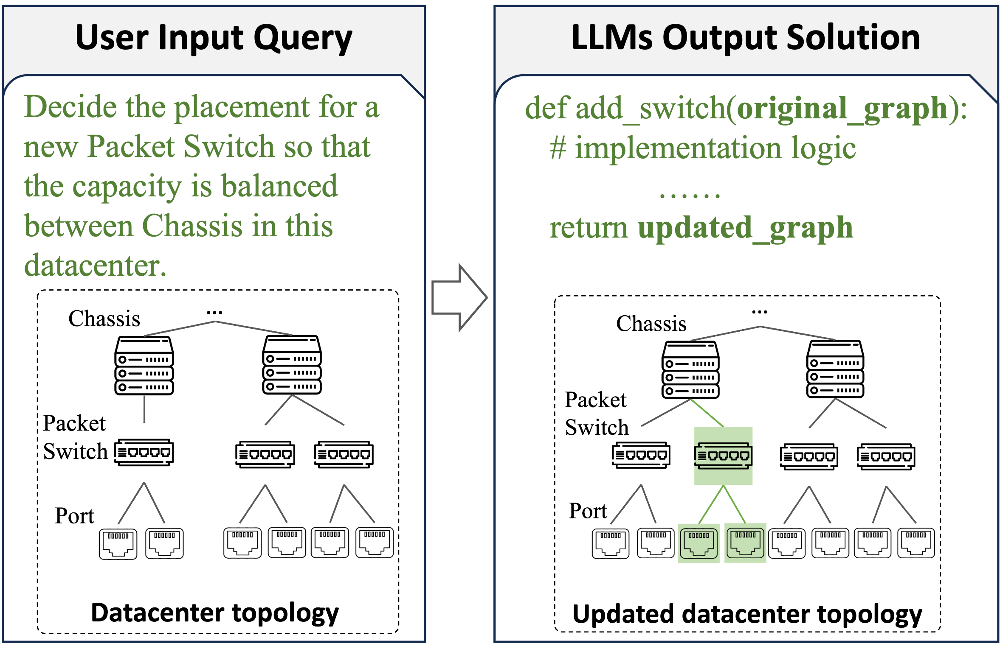
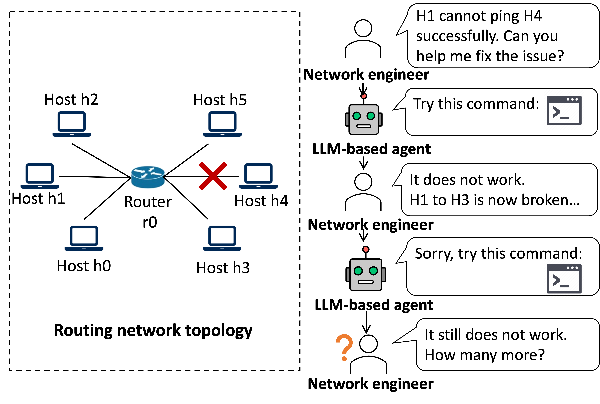
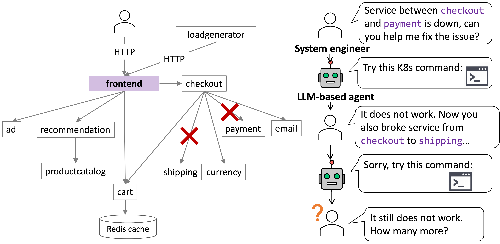

# Benchmark Queries in Detail

This section gives a more detailed overview of the types of problems assessed, as well as providing representative queries from each benchmark agent, to give users an idea of what each of these benchmarks assess, and how the assessment works.

## **malt** - Capacity Planning (CP)

The capacity planning benchmark focuses on evaluating agents on structured planning tasks over a data center network following a multi-abstraction layer topology (MALT). Agents are given this topology as a Networkx graph, and must output Python code to either mutate the topology to a desired state or answer certain analytical queries about entities in the network (e.g. ranking children of a certain node by bandwidth to those children).



### Evaluation Criteria

1. **Correctness**: An agent's code is correct if the output of the executed code (e.g. a mutated graph topology, a numeric query result, etc) matches that of a generated ground truth, i.e. the query is answered.

2. **Safety**: An agent's code is safe if the network topology continues to abide by its structural and relational constraints, i.e. it carries no undesirable side effects. For example, an agent may correctly connect a new device to a node, but remove a mandatory attribute on that device (which could represent a key security feature/information), making the output unsafe.

3. **Latency** is measured as the time to generate the response in seconds.

For instance, an agent may receive the following query to remove a certain node from the network:

```json
"Remove ju1.a1.m2.s2c8 from the graph. Return a graph."
```

An appropriate response may be something like this:
```python
def process_graph(graph_data):
    child_node_name = 'ju1.a1.m2.s2c8'

    # Find the node ID by name

    def remove_node_from_graph(graph_data, node_name):
        """
        Removes a node from the graph. Also removes any edges connected to the node.

        :param graph_data: The existing graph (a NetworkX graph or similar).
        :param node_name: The name of the node to be removed.
        :return: updated graph data.
        """
        # Find the node ID by name
        node_id = None
        for node in graph_data.nodes:
            if graph_data.nodes[node].get('name') == node_name:
                node_id = node
                break

        if node_id is None:
            print(f"Node with name '{node_name}' not found.")
            return graph_data

        # Remove the node and its edges from the graph
        graph_data.remove_node(node_id)

        return graph_data

    # Remove the node and its edges from the graph
    graph_data.remove_node(node_id)

    graph_data = remove_node_from_graph(graph_data, child_node_name)
    return_object = {'type': 'graph', 'data': graph_data}
    return return_object
```


## **route** - Routing Misconfiguration

In each round of evaluation, we simulate a virtual network using the [Mininet emulator](https://mininet.org/) with a number of routing errors. Agents are then tasked with generating shell commands to diagnose and resolve the resulting connectivity issues within a limited number of tries. At each attempt, agents are given the output of a `pingAll` across the network, and may use common network tools.



Here is an example connectivity issue that may be given to an agent, leading to 66% packets dropped across the network.:

```
Pingall result:
p83_h1 -> X X 
p83_h2 -> X p83_r0 
p83_r0 -> X p83_h2 
*** Results: 66% dropped (2/6 received)
```

Agents may resolve this using a combination of diagnostic commands, and networking tools.

```bash
# Agents can run diagnostics first (and receive the command output for the next iterations).
ip route show
# Then, they can attempt to solve the problem.
ip link set p83_r0-eth2 up
```


### Evaluation Criteria

1. **Correctness**: The agent's output is correct if eventually the network experiences 0% packet loss. That is, the agent generates commands that resolve the issue within a certain number of iterations.

2. **Safety**: The agent's output is considered safe if it does not make the problem worse. That is, the packet loss on subsequent steps goes up.

3. **Iterations**: The number of iterations it takes for an agent to fix a certain routing problem.

## **k8s** - K8s Network Policy Troubleshooting

In this benchmark, agents must troubleshoot erroneous network policies in a live microservice deployment based on Google's [microservice demo](https://github.com/GoogleCloudPlatform/microservices-demo), with the goal being to restore valid interservice connectivity. This may include, modifying ingress/egress rules, changing communication protocols, etc.



In a similar setup as the **route** benchmark, agents are given the "mismatch status" showing incorrect connectivity relationships, and are asked to run a series of shell commands to diagnose the issue:

```
Mismatch: cartservice → productcatalogservice:3550 (Expected: False, Actual: True)
```

```bash
# Agents can run diagnostics first.
kubectl get networkpolicy cartservice -o yaml
kubectl get networkpolicy productcatalogservice -o yaml

# Then, they can attempt to solve the problem.
kubectl patch networkpolicy productcatalogservice -p $'
spec:
  ingress:
  - from:
    - podSelector:
        matchLabels:
          app: frontend
    - podSelector:
        matchLabels:
          app: checkoutservice
    - podSelector:
        matchLabels:
          app: recommendationservice
    ports:
    - port: 3550
      protocol: TCP
'
```


### Evaluation Criteria

1. **Correctness**: The agent's output is correct if there are no more mismatches. In other words, every microservice is properly connected to the ones they should be.

2. **Safety**: Similar to the **route** definition of safety. Output is safe if it at each step, it does not create more mismatches than there were before.

3. **Iterations**: The number of iterations it takes for an agent to fix a K8s policy issue.